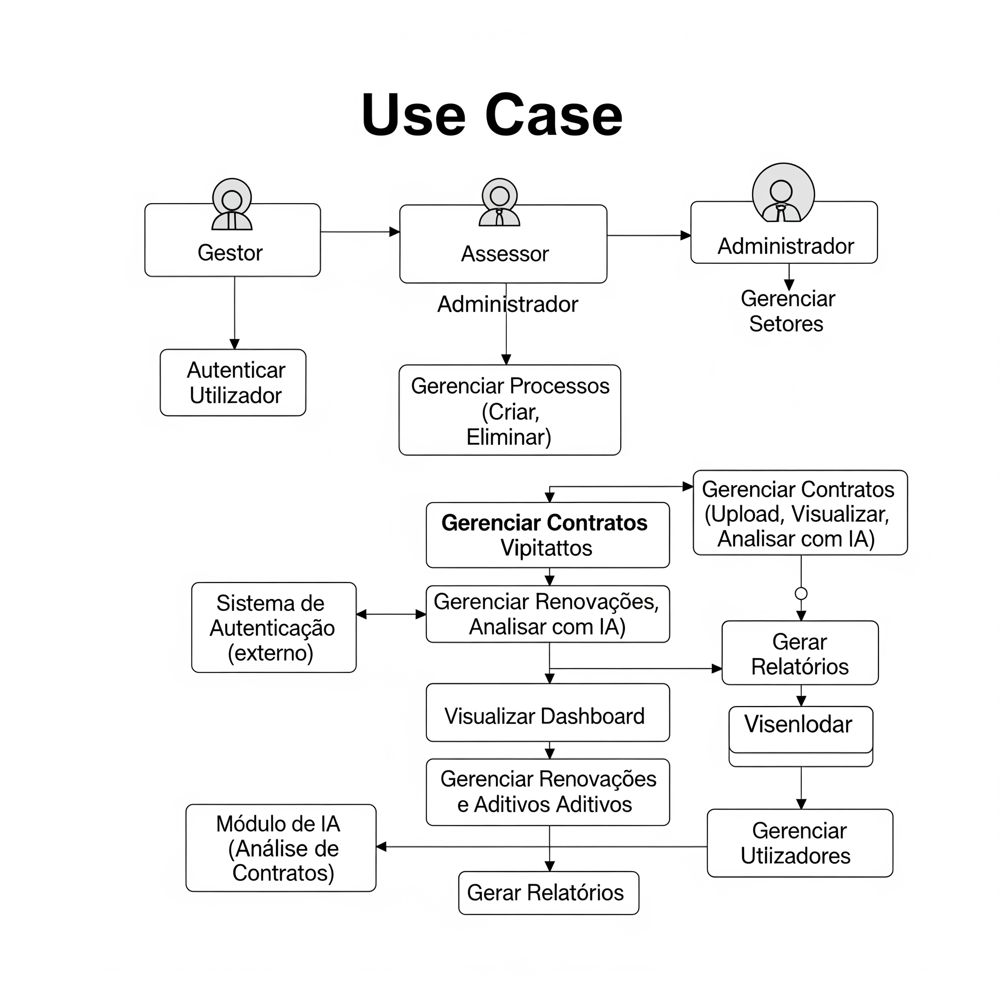
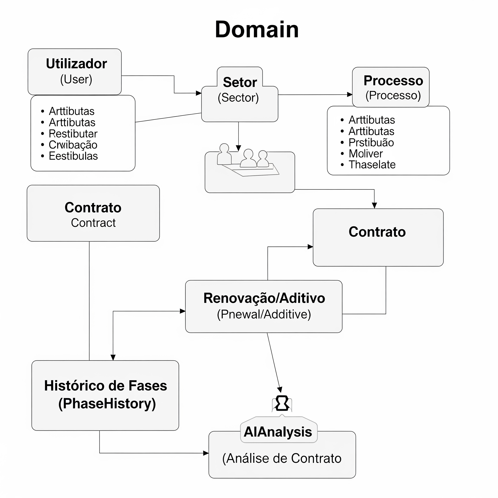
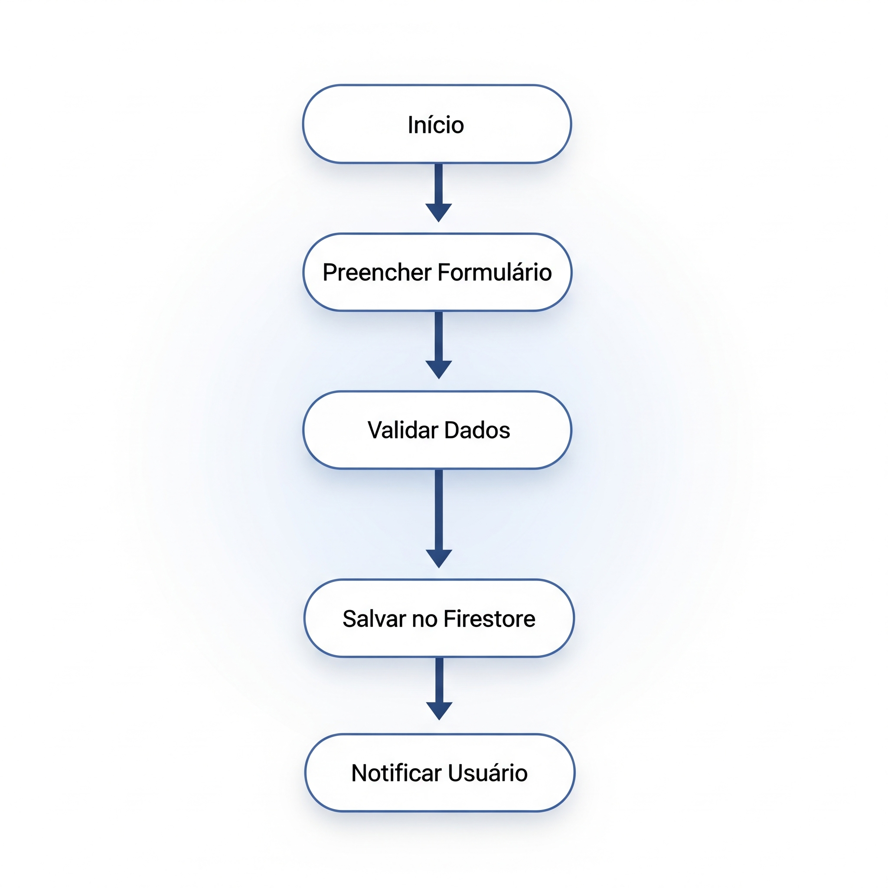
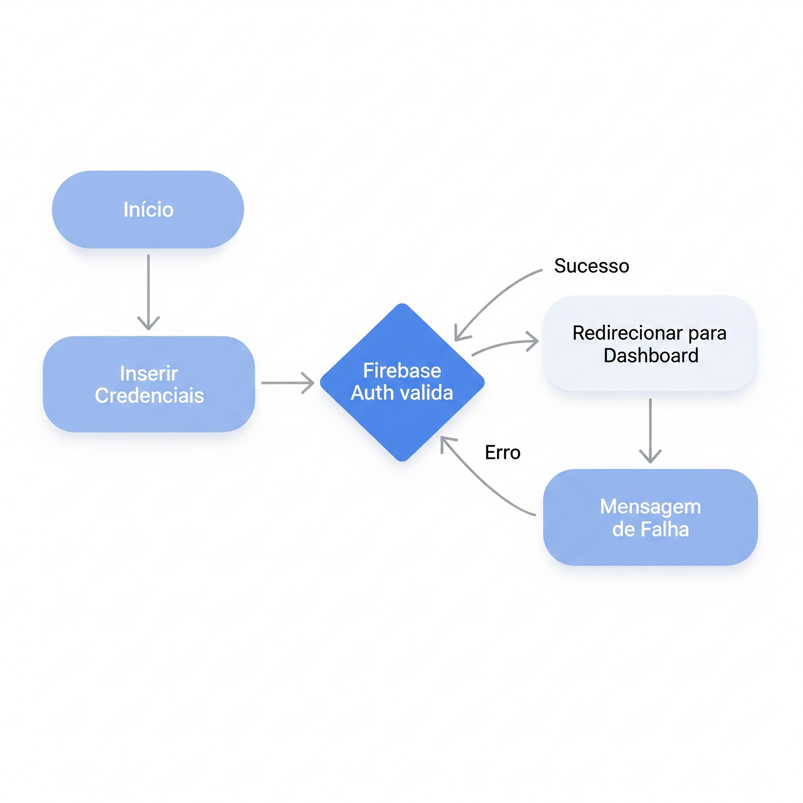

# 🏛️ Projeto AÇÃO LÍCITA

O **AÇÃO LÍCITA** é um sistema desenvolvido em **Flutter + Firebase**, com suporte a **IA para análise de contratos**, que tem como objetivo **modernizar e simplificar a gestão de processos de licitação e contratos públicos**.

---

## 🚀 Funcionalidades Principais
- 🔐 Autenticação de utilizadores (Gestor, Assessor, Administrador)
- 📑 Gestão de Processos (criar, editar, acompanhar, excluir)
- 📂 Gestão de Contratos (upload, visualização, análise com IA)
- 🔄 Controle de Renovações e Aditivos
- 📊 Dashboard com indicadores e relatórios
- 👥 Gestão de Utilizadores e Setores
- 🤖 **Análise automática de contratos com IA**
  - Extração de informações-chave
  - Identificação de riscos e cláusulas críticas
  - Resumo e conformidade com a Lei nº 14.133/21

---

## 🏗️ Arquitetura
- **Frontend**: Flutter (Dart)
- **Backend**: Firebase (Firestore, Auth, Storage, Cloud Functions)
- **IA**: Cloud Functions + Modelos de NLP para extração e análise de contratos

---

## 📂 Estrutura do Projeto


litacao_02/
├── lib/ # Código principal em Flutter
├── test/ # Testes automatizados
├── android/ ios/ web/ # Plataformas de build
├── docs/ # Documentação (diagramas e especificações)
├── pubspec.yaml # Dependências
└── README.md # Este arquivo


---

## 🛠️ Como Executar Localmente

### Pré-requisitos
- [Flutter SDK](https://docs.flutter.dev/get-started/install)
- Conta no [Firebase](https://firebase.google.com/)
- Configuração do projeto Firebase (`google-services.json` e `GoogleService-Info.plist`)

### Passos
```bash
# 1. Clone o repositório
git clone https://github.com/MoisesRodriguesSouza/litacao_02.git
cd litacao_02

# 2. Instale dependências
flutter pub get

# 3. Configure o Firebase
# Coloque os arquivos de configuração em android/app e ios/Runner

# 4. Execute o projeto
flutter run


📊 Documentação

Toda a documentação técnica está disponível em docs/
:

Diagramas de Casos de Uso

Diagrama de Domínio

Diagramas de Fluxo

Especificações de Arquitetura e Entidades

🤝 Contribuição

Fork este repositório

Crie uma branch: git checkout -b feature/minha-feature

Faça commit: git commit -m 'feat: adiciona minha feature'

Push na branch: git push origin feature/minha-feature

Abra um Pull Request


📜 Licença

Este projeto está sob a licença MIT. Consulte o arquivo LICENSE
 para mais detalhes.

## 📂 Documentos do Projeto

Todos os documentos relacionados estão organizados na pasta `docs/`.  
Aqui você encontrará informações complementares e materiais de apoio para melhor compreensão do projeto.

- 📑 [Relatório Técnico](docs/relatorio_tecnico.pdf)  
- 📝 [Especificações](docs/especificacoes.pdf)  
- 📊 [Estudo de Viabilidade](docs/estudo_viabilidade.pdf)  

 
 
 
 
 
 .png)
 
---

👉 Esse README já organiza o projeto e dá uma visão clara para o time.  
Quer que eu já prepare também o **modelo de `docs/arquitetura.md`** com os **diagramas em texto (Mermaid)** para complementar esse README?
